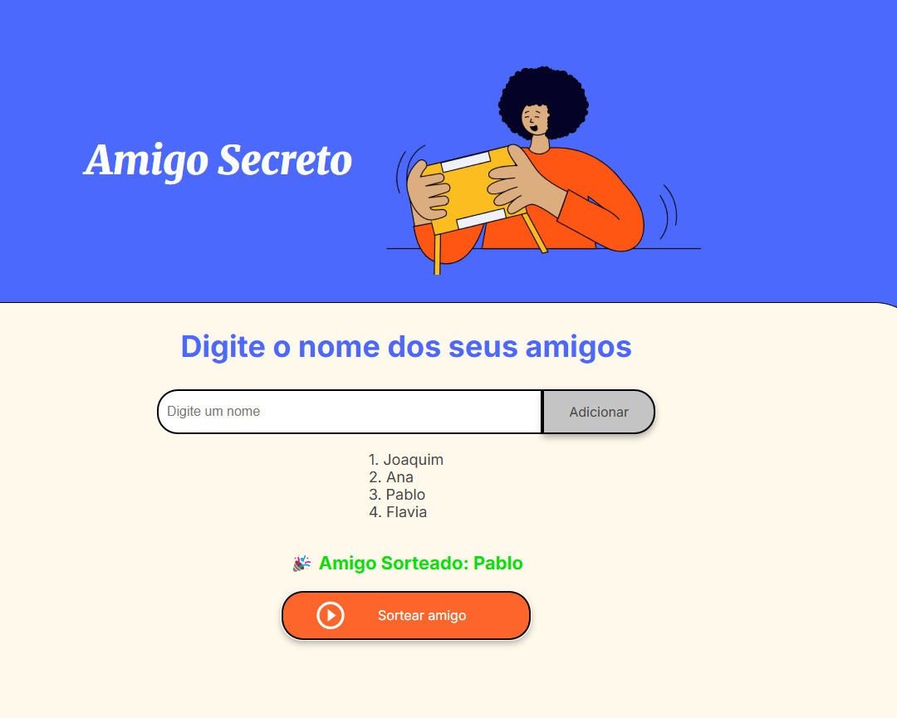

# O Desafio Amigo Secreto 🎁

O **Desafio Amigo Secreto** é um sistema interativo para organizar um sorteio de Amigo Secreto. Ele permite adicionar participantes, realizar o sorteio automaticamente e exibir os pares formados. O objetivo é proporcionar uma experiência simples e divertida para grupos que desejam organizar um Amigo Secreto de maneira rápida e eficiente.

## 📌 Objetivos
- Praticar e aperfeiçoar a lógica de programação
- Consolidar conhecimentos em **JavaScript**
- Criar um sistema funcional e interativo para sorteios
- Desenvolver habilidades de análise e solução de problemas

## 🚀 Funcionalidades
- **Adicionar Participantes**: Permite incluir nomes na lista do sorteio.
- **Realizar o Sorteio**: O sistema organiza os pares de maneira aleatória garantindo que ninguém se tire a si mesmo.
- **Exibir os Resultados**: Após o sorteio, a lista de pares é exibida para consulta.

## 🛠️ Tecnologias Utilizadas
- **JavaScript** (Linguagem principal)
- **HTML & CSS** (Interface visual, se aplicável)

### Opção 1: Executar diretamente no navegador
1. Clone este repositório:
   ```bash
   git clone https://github.com/iwillteixeira/challange_oracle
   ```
2. Abra o arquivo `index.html` no navegador.


## 📸 Capturas de Tela

### Interface de Cadastro


### Sorteio dos Participantes


### Exibição dos Resultados


## 🎥 Demonstração

## 📜 Licença
Este projeto está licenciado sob a [MIT License](LICENSE).